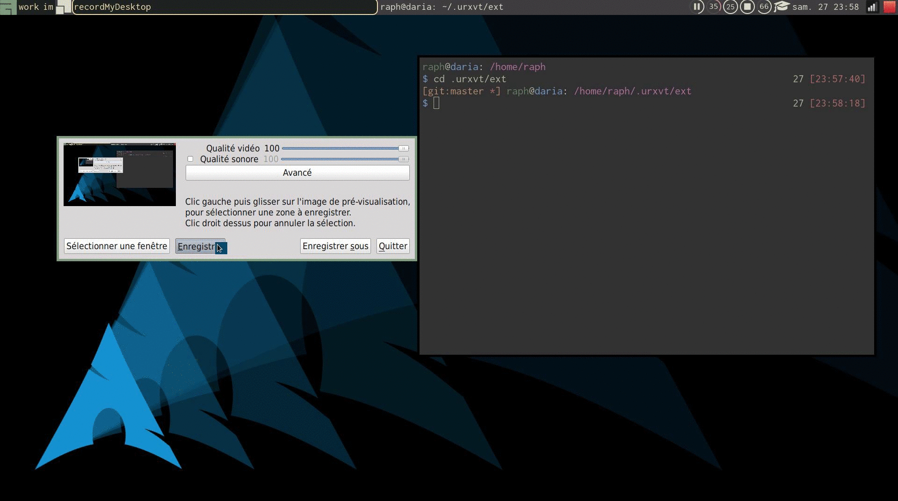

# urxvt-perl

## open-filebrowser-imageviewer

This is a little extension that opens a GUI filebrowser (Thunar, Nautilus) at
the selection, or an image viewer (like gthumb). It is aimed at being the
converse of the "open terminal here" in such applications. It can be triggered
via a keyboard shortcut or with the CTRL-rightclick menu (selection popup in
urxvt language).

The command can can be set via a resource:

   URxvt.open-filebrowser.cmd: thunar
   URxvt.open-imageviewer.cmd: thunar
   
The code is (very heavily) based on the code of the `selection-popup` extension.

